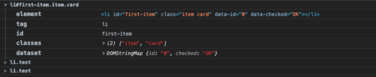

> A collection of JS utils (DOM manipulation, events, maths, debounce)  

# Introduction

## Install

```bash
yarn add @qneyraud/q-utils
```

## Usage

```js
import { ... } from '@qneyraud/q-utils'
```

## Development

```
# clone repo
git clone git@github.com:quentinneyraud/q-utils.git
cd q-utils

# install dependencies
yarn

# Run examples
npm run dev

# Run docs
npm run docs
```

## Build

```bash
npm run build
```

<div style="margin-top: 200px"></div>

# Functions

## qs

> Select the first HTML element which match with selector in parent

#### Syntax

```js
qs(parent, selector)
```

#### Parameters

###### parent

The parent of the element : `( HTMLElement | HTMLCollection | Array | DOMString )`

###### selector

A `DOMString` containing one selector to match against

#### Return value

An `HTMLElement` that matches the selector or `null` 

#### Example

```html
<body>
  <ul class="list" id="list1">
    <li>Hello</li>
    <li>World</li>
  </ul>
  <ul class="list">
    <li>Foo</li>
    <li>Bar</li>
  </ul>
</body>
```

```js
import { qs } from '@qneyraud/q-utils'

qs(document.body, 'li') // <li>Hello</li>
qs('#list1', 'li') // <li>Hello</li>
```

<div style="margin-top: 150px"></div>

## qsa

> Select all HTML elements which match with selector in parent

#### Syntax

```js
qsa(parent, selector)
```

#### Parameters

###### parent

The parent of the elements : `( HTMLElement | HTMLCollection | Array | DOMString )`

###### selector

A `DOMString` containing one selector to match against

#### Return value

An `Array` of `HTMLElement` that matches the selector or `null` 

#### Example

```html
<body>
  <ul id="list">
    <li>Hello</li>
    <li>World</li>
  </ul>
</body>
```

```js
import { qsa } from '@qneyraud/q-utils'

qsa(document.body, 'ul') // [<ul id="list">...</ul>]
qsa('#list', 'li') // [<li>Hello</li>, <li>World</li>]
```

<div style="margin-top: 150px"></div>

## gebi

<div style="margin-top: 150px"></div>

## gebc

> Select the first or all HTML elements which match with the className in parent

#### Syntax

```js
gebc(parent, className)
```

#### Parameters

###### parent

The parent of the elements : `( HTMLElement | HTMLCollection | Array | DOMString )`

###### className

A `String` containing one selector to match against

#### Return value

An `Array` of `HTMLElement` which match with the className.  
Or `null` if nothing matches.

#### Example

```html
<body>
  <ul id="list">
    <li class="item">1st item</li>
    <li class="item">2nd item</li>
    <li class="item">3rd item</li>
    <li class="item">4th item</li>
    <li class="item">5th item</li>
  </ul>
</body>
```

```js
import { gebc } from '@qneyraud/q-utils'

gebc(document.body, 'item') // [<li class="item">1st item</li>, <li class="item">2nd item</li>, ...]
gebc('#list', 'card') // null
```

<div style="margin-top: 150px"></div>

## addClass

<div style="margin-top: 150px"></div>

## removeClass

<div style="margin-top: 150px"></div>

## addEvent

<div style="margin-top: 150px"></div>

## removeEvent

<div style="margin-top: 150px"></div>

## getPos

<div style="margin-top: 150px"></div>

## hasProperties

<div style="margin-top: 150px"></div>

## isOneOf

<div style="margin-top: 150px"></div>

## lerp

<div style="margin-top: 150px"></div>

## clamp

> Get a clamped value between optional min and max parameters

#### Syntax

```js
clamp(value[, min = null[, max = null]])
```

#### Parameters

###### value

The `Number` that will get clamped

###### min

The lower edge of the desired range: `Number`

###### max

The lower edge of the desired range: `Number`

#### Return value

The `value` parameter clamped between `min` and `max`

#### Example

```js
import { clamp } from '@qneyraud/q-utils'

const a = 50
const b = 8750

// min and max
clamp(a, 100, 200) // 100
clamp(b, 100, 200) // 200

// only min
clamp(a, 75) // 75
clamp(b, 75) // 8750

// only max
clamp(a, null, 200) // 50
clamp(b, null, 200) // 200
```

<div style="margin-top: 150px"></div>

## map

> Get a mapped number from starting range to the desired range, optionaly clamped

#### Syntax

```js
map(value, start1, end1, start2, end2[, clamped = false])
```

#### Parameters

###### value

The `Number` that will get mappped

###### start1

Lower edge of the starting range: `Number`

###### end1

Upper edge of the starting range: `Number`

###### start2

Lower edge of the desired range: `Number`

###### end2

Upper edge of the desired range: `Number`

###### clamped

A `Boolean` value that specifies whether the value be clamped between `start2` and `end2`. Default is `false`, the value is not clamped

#### Return value

The `value` parameter mapped

#### Example

```js
import { clamp } from '@qneyraud/q-utils'

const a = 50
const b = 8750

// min and max
clamp(a, 100, 200) // 100
clamp(b, 100, 200) // 200

// only min
clamp(a, 75) // 75
clamp(b, 75) // 8750

// only max
clamp(a, null, 200) // 50
clamp(b, null, 200) // 200
```

<div style="margin-top: 150px"></div>

## serializeForm

<div style="margin-top: 150px"></div>

## setStyle

> Set style to a single or a list of HTML elements

#### Syntax

```js
setStyle(elements, styles)
```

#### Parameters

###### elements

The element(s) : `( HTMLElement | HTMLCollection | Array | DOMString )`

###### styles

An `Object` of the CSS rules

#### Example

```html
<body>
  <ul id="list">
    <li class="item">1st item</li>
    <li class="item">2nd item</li>
    <li class="item">3rd item</li>
    <li class="item">4th item</li>
    <li class="item">5th item</li>
  </ul>
</body>
```

```js
import { setStyle } from '@qneyraud/q-utils'

// Remove margin on body tag
setStyle(document.body, {
  margin: '0px'
})

// Set styles on all elements which match selector li.item 
setStyle('li.item', {
  color: 'red',
  display: 'inline-block'
})
```

<div style="margin-top: 150px"></div>

## debounce

<div style="margin-top: 150px"></div>

## logElement

> Log element(s) with tag, id, classes and dataset informations

#### Syntax

```js
logElement(elements [, collapsed = false])
```

#### Parameters

###### elements

The elements to log : `( HTMLElement | HTMLCollection | Array | DOMString )`

###### collapsed

A `Boolean` value that specifies whether the log be collapsed in browser console. Default is `false`, log is expanded

#### Example

```html
<body>
  <ul>
    <li id="first-item" class="item card" data-id="0" data-checked="OK"></li>
    <li class="test" data-id="1"></li>
    <li class="test" data-id="2"></li>
  </ul>
</body>
```

```js
import { gebi, logElement } from '@qneyraud/q-utils'

const el = gebi('test')

logElement(el)
logElement('.test', true)
```



<div style="margin-top: 150px"></div>
